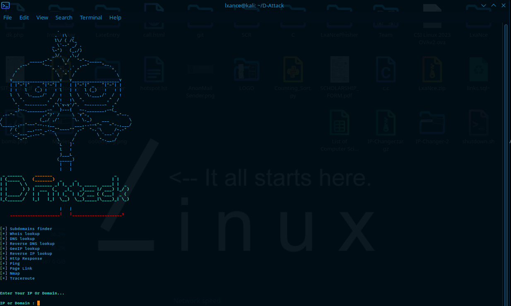

# D-Attack
D-Attack tool is used for gathering information of Website 😉
### THIS TOOL IS CREATED FOR EDUCATIONAL PURPOSE, DON'T MISUSE IT.
<p align="center">
  
</p>

## Installing Process 👇
```$ git clone https://github.com/LxaNce-Hacker/D-Attack```<br>
```$ apt-get install pv```<br>
## Running Process 👇
```$ cd D-Attack```<br>
```$ bash D-Attack.sh```<br>

## Workflow 👇
<br>
<p align="center">
  
</p>
